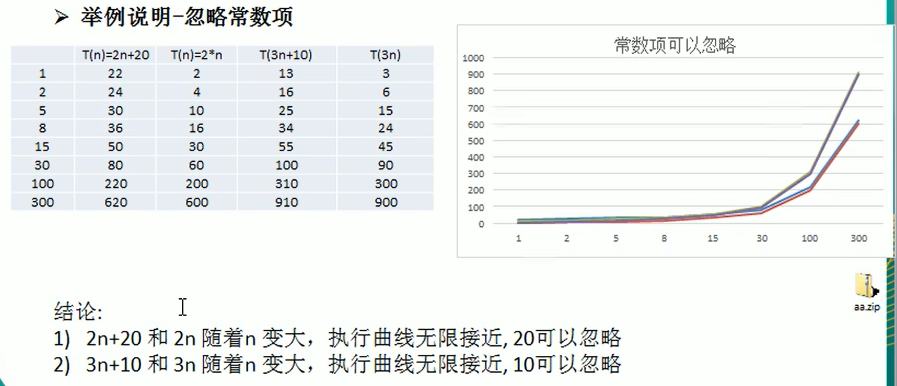
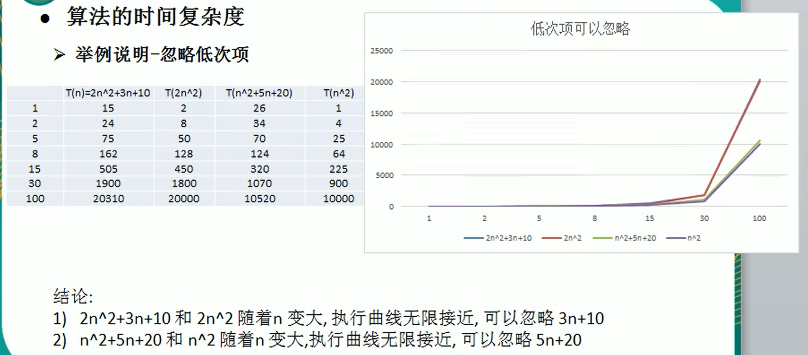
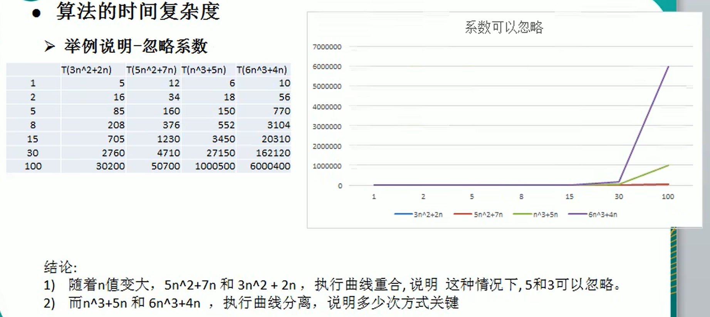
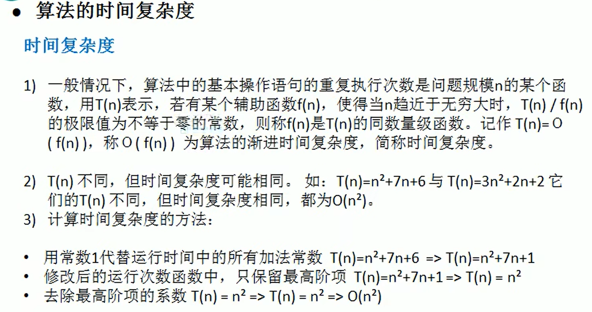
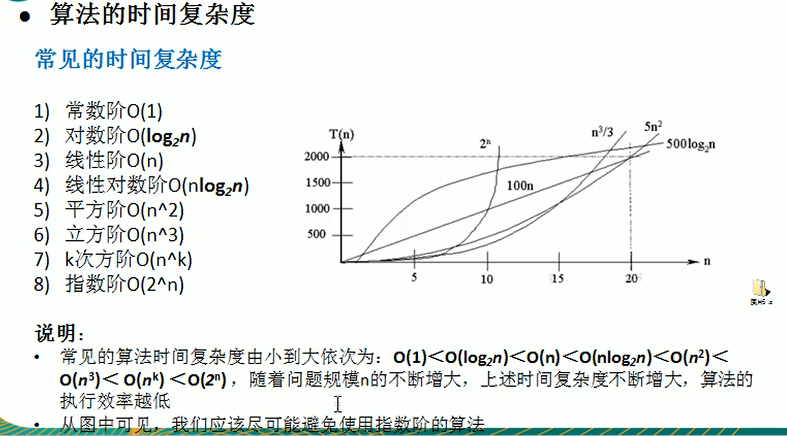
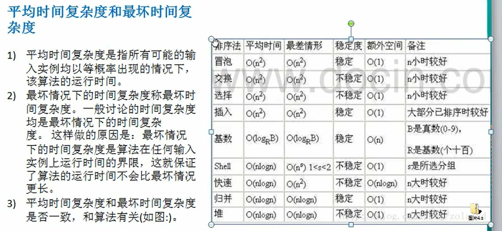

## 1. 时间频度

一个算法花费的时间与算法中语句的执行次数成正比，哪个算法中语句执行次数多，它花费的时间就多。一个算法中的语句执行次数称为语句频度或时间频度，记作T(n)

说白了就是语句越多，花的时间越久

下面举2个例子

```java
int total = 0;
int end = 100;
for (int i = 1; i < end; i++) {
	total += 1;
}
// 这个时间复杂度就是T(n) = n+1
// n代表需要循环的次数，+1代表最后一次判断
```

```java
total = (1 + end) * end / 2;
// 这个时间复杂度就是T(n) = 1
// 因为只有一条语句的执行
```

## 2. 可以忽略常数项




## 3. 忽略低次项




## 4. 忽略系数




## 5. 时间复杂度



重点是最后的三句话

1. 用常数代替所有加法常数
2. 只保留最高阶项
3. 去除系数

## 6. 常见的时间复杂度



### 1. 常数阶

无论执行多少行代码，只要没有循环等复杂结构，这个代码的时间复杂度都是O(1)

```java
int i = 1;
int j = 2;
++i;
j++;
int m = i + j;
```


### 2. 对数阶

在while循环中，每次都会 * 2，让i越来越接近n

那么就是$2^x = n$，我们要的公式就是x = ？以代码中的例子，公式就是$\log_{2}1024 = 10$（次）

所以时间复杂度就是O(logn)


```java
int i = 1;
int n = 1024;
while (i < n) {
    i = i * 2;
}
```


### 3.线性阶

单层的循环就是线性阶

for循环里的代码会执行n+1遍，但是舍去常数项，就是n次，时间复杂度就是O(n)

```java
for (int i = 0; i < n; i++) {
    j = i;
    j++;
}
```


### 4. 线性对数阶

就是把上面对数阶代码丢进循环n遍的代码里

```java
int i = 1;
int n = 1024;
for (int i = 0; i < n; i++) {
    while (i < n) {
        i = i * 2;
    }
}
```


### 5. 平方阶

你可以粗暴的理解是双重for循环，后面的立方阶，k阶都是多少次循环

像下面的代码，时间复杂度就是$O(n^2)$

```java
int num = 0;
for (int i = 0; i < n; i++) {
    for (int j = 0; j < n; j++) {
        num++;
    }
}
```


如果是不同的循环条件呢

像下面的代码，时间复杂度就是$O(m * n)$

```java
int num = 0;
for (int i = 0; i < m; i++) {
    for (int j = 0; j < n; j++) {
        num++;
    }
}
```


## 7. 平均时间复杂度和最坏时间复杂度




## 空间复杂度的概述

因为算法基本上都是用空间换时间，所以讨论空间复杂度并没有多大的意义